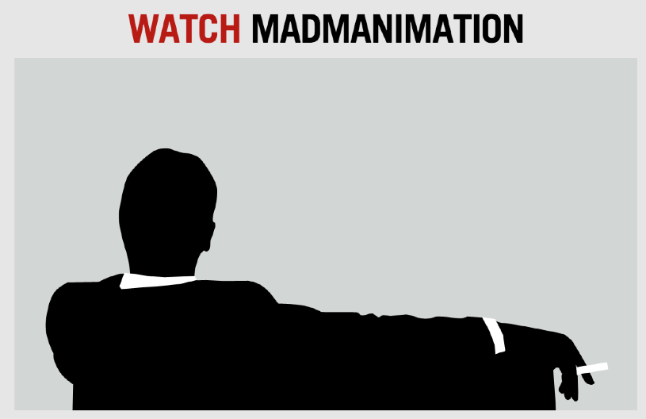

#MADMANIMATION

[Demo link on http://stuffandnonsense.co.uk/](http://stuffandnonsense.co.uk/content/demo/madmanimation/)

[Link to oldschool article](http://www.anthonycalzadilla.com/2011/04/behind-the-scenes-of-mad-manimation/)

Catch me on the twitters at [@clzd](https://twitter.com/clzd)

Madmanimation code by [Anthony Calzadilla](http://hardboiledwebdesign.com/)
Art direction, HTML and “[hardboiled](http://hardboiledwebdesign.com/)” CSS by [Andy Clarke](http://stuffandnonsense.co.uk/)
Image manipulation by [Geri Coady](http://hellogeri.com/)
Madmanimation uses [Modernizr](http://modernizr.com/).

Original photography by Geri Coady, Nate Croft, Kat Durrant, Peter Hart, Mark Jaquith, Chris Jennings, Jeremy Keith, Maykel Loomans, John Morrison - Subism.com, Stefan Nitzsche, Warren Parsons and Jeffrey Zeldman.

Madmanimation is for educational purposes only and is not affiliated with the Mad Men TV show. 
All American Movie Classics Company LLC. copyrights, trademarks and tradenames are respected.